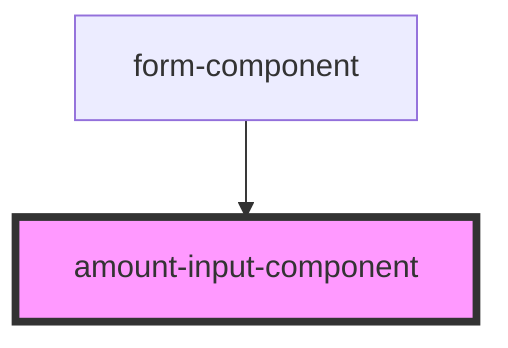

# # Stencil Component - amount-input-component

The `amount-input-component` is a Stencil component designed to provide an input field for entering decimal numbers, allowing the user to input both whole and decimal parts. It supports validation for empty inputs, inputs containing letters, and negative values. Additionally, the component's monetary formatting is performed using the user's browser locale.

## Installation

To use the `amount-input-component` in your project, follow these steps:

### Import the component in your application:

```bash
    import '@design-system-name/amount-input-component';
```

### Usage

Once the component is installed, you can use it in your HTML or JSX files as follows:

```html
<amount-input-component model="{yourFormItemModel}" update="{handleUpdate}"> </amount-input-component>
```

### Attributes

`model` (required): A FormItemModel instance that holds the `value` for the input. It should have a value property which represents the numeric amount.

`update` An event that is emitted when the form item model is updated.

### Events

`update` An event that is emitted when the form item model is updated. The updated form item model is provided as the event payload.

## Methods

#### handleWholeChange(event: Event):

Called when the `whole` part of the input changes. It updates the whole part of the amount and emits the `update` event.

#### handleDecimalsChange(event: Event):

Called when the `decimal` part of the input changes. It updates the decimal part of the amount and emits the `update` event.

### Usage

Once the component is installed, you can use it in your HTML or JSX files as follows:

```html
<form>
  <amount-input-component model="{yourFormItemModel}" update="{handleUpdate}"> </amount-input-component>
</form>
```

<!-- Auto Generated Below -->

## Properties

| Property | Attribute | Description | Type            | Default     |
| -------- | --------- | ----------- | --------------- | ----------- |
| `model`  | --        |             | `FormItemModel` | `undefined` |

## Events

| Event    | Description                                  | Type                         |
| -------- | -------------------------------------------- | ---------------------------- |
| `update` | Emitted when the form item model is updated. | `CustomEvent<FormItemModel>` |

## Dependencies

### Used by

- [form-component](../form-component)

### Graph



---

_Built with [StencilJS](https://stenciljs.com/)_
