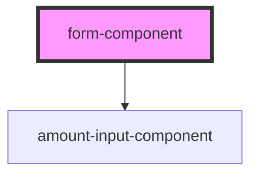

# Stencil Component - form-component

`form-component` is a Stencil component designed to create a simple form with validation capabilities. It utilizes the Shadow DOM for encapsulation and reusability.

## Installation

To use the `form-component` in your project, follow these steps:

### Install the package using npm

```bash
    npm install @design-system-name/form-component --save
```

### Import the component in your application:
```bash
    import '@design-system-name/form-component';
```

### Usage
Once the component is installed, you can use it in your HTML or JSX files as follows:
```html
    <form-component></form-component>
```

### Attributes
The `form-component` component does not currently support any attributes.

### Properties
`model`: An object representing the form model with fields and their validation information.

`errors`: An object containing validation errors, if any.

`isDisabled`: A boolean indicating whether the submit button should be disabled based on form validity.

### Events
`onUpdate`: An event emitted when a field's value changes. It provides updated field information for validation.

<!-- Auto Generated Below -->


## Dependencies

### Depends on

- [amount-input-component](../amount-input-component)

### Graph


----------------------------------------------

*Built with [StencilJS](https://stenciljs.com/)*
